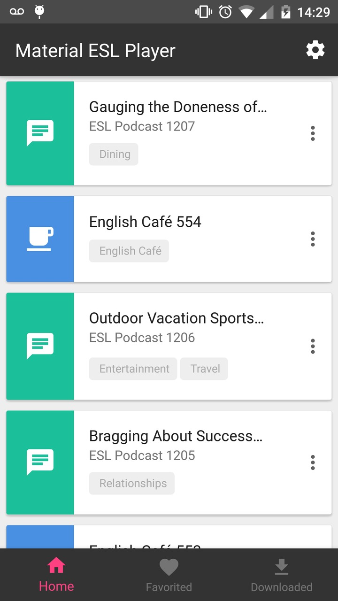
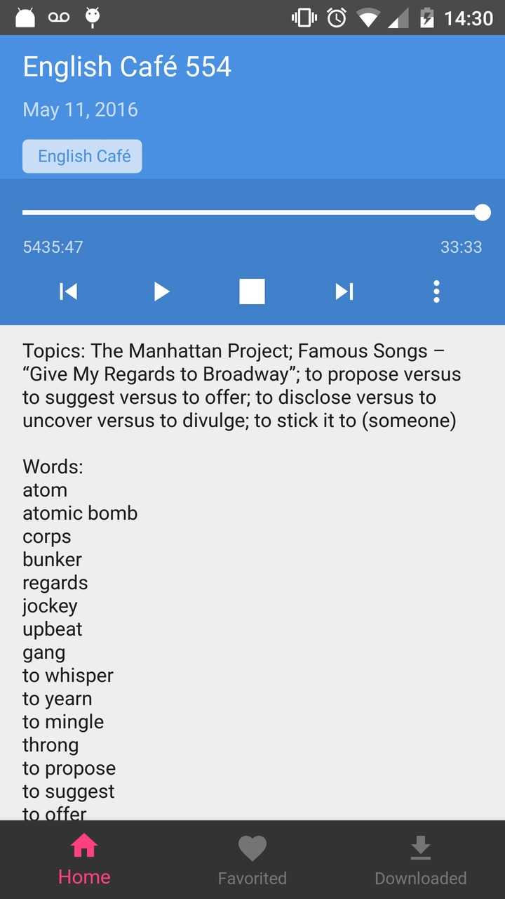
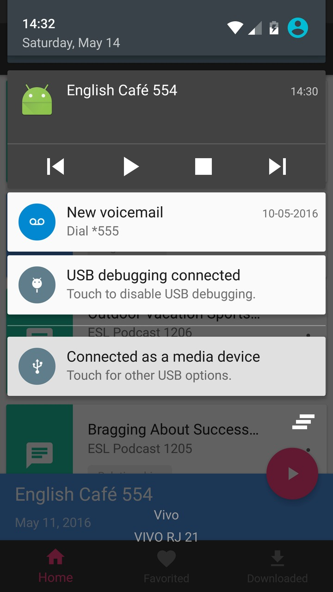
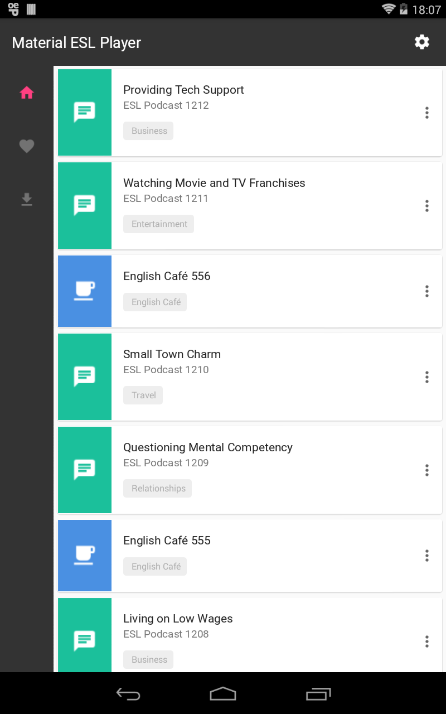
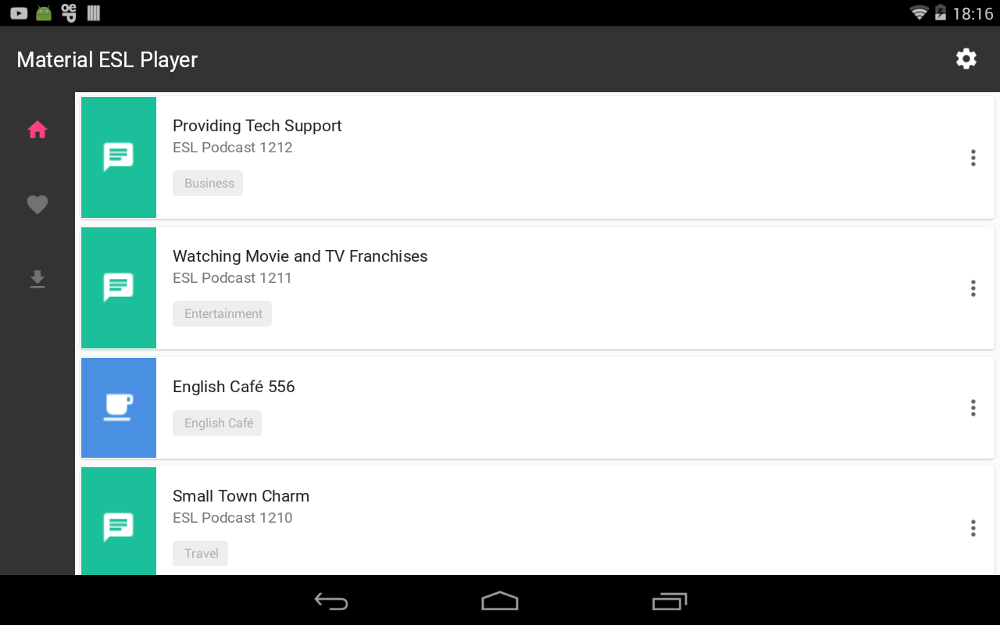
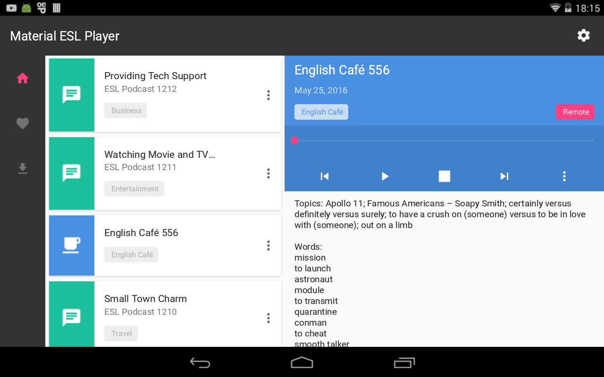
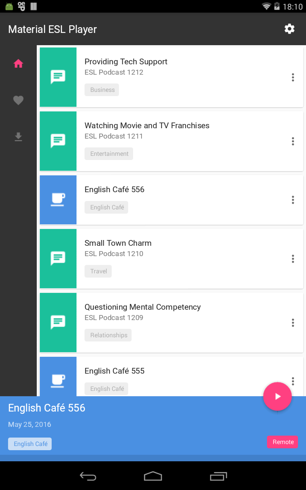
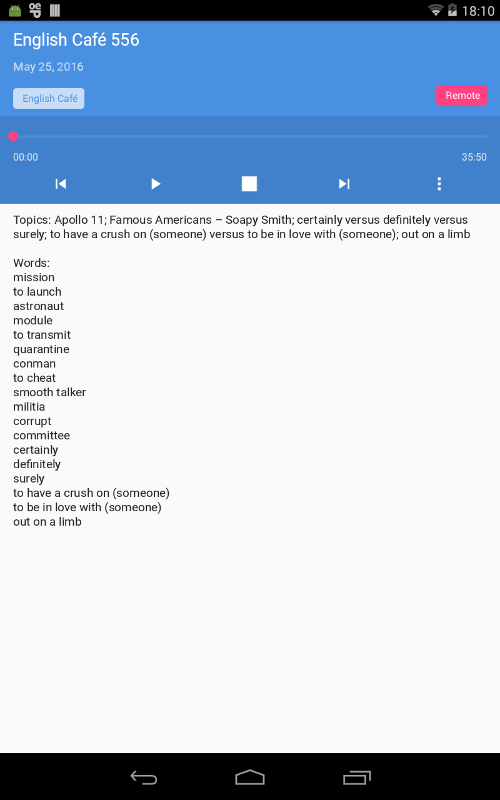

# ESL Pod Client

This is a hobby and unofficial project to learn some concepts and tools, including:

 - Kotlin language
 - MVP pattern with RxJava (not RxKotlin)
 - Dagger2
 
The app uses jsoup to gather the podcasts of ESL Podcast website and allowing the user to store and listen any podcast with streaming or using local storage.

It uses a combination of MediaPlayer and MediaPlayback for streaming audio and DownloadManager to handle the download complexity.

## Some Screenshots

### Phone Screenshots

### Tablet Screenshots

#### Design made by [Tatipiment](https://github.com/Tatipiment)
 
----

## Dependencies

To run this project you need to have:

 - JDK 7
 - Android Studio 2.2 or higher
 - Kotlin plugin for Android Studio

---

## Setup the project

1. Install the dependencies above
2. `$ git clone --recursive https://github.com/wakim/esl-pod-client.git` - Clone the project with submodules
4. if the folder `androidvideocache-library` is empty then:
 - `$ cd esl-pod-client` - Go into the project folder
 - `$ git submodule update --init --recursive` - Initialize and fetch submodule
5. Do not edit any file in submodule, it must be read-only.
6. Open Android Studio
7. Click "Import project (Eclipse ADT, Gradle, etc.)"
8. Build the project to see if everything is working fine

## License
<pre>
Copyright 2016 Wakim Jraige

Licensed under the Apache License, Version 2.0 (the "License");
you may not use this file except in compliance with the License.
You may obtain a copy of the License at

   http://www.apache.org/licenses/LICENSE-2.0

Unless required by applicable law or agreed to in writing, software
distributed under the License is distributed on an "AS IS" BASIS,
WITHOUT WARRANTIES OR CONDITIONS OF ANY KIND, either express or implied.
See the License for the specific language governing permissions and
limitations under the License.
</pre>
